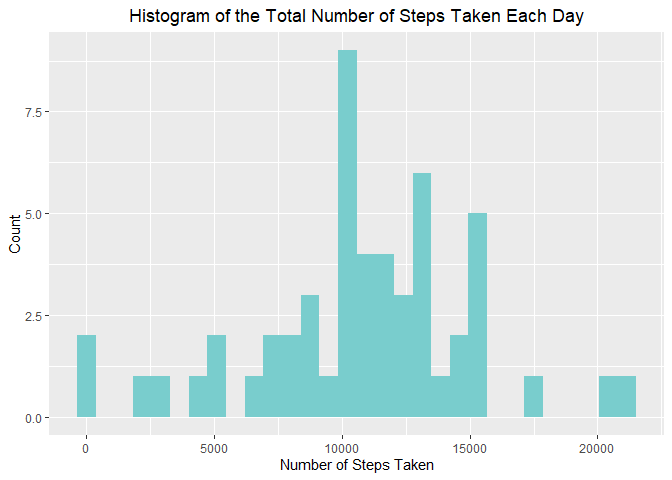
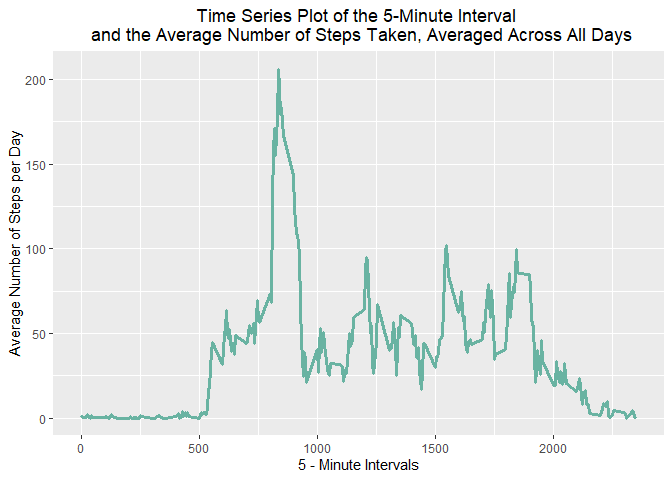
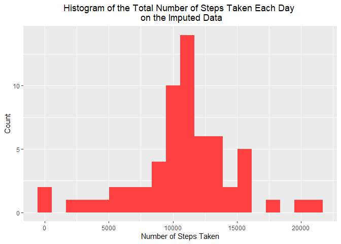
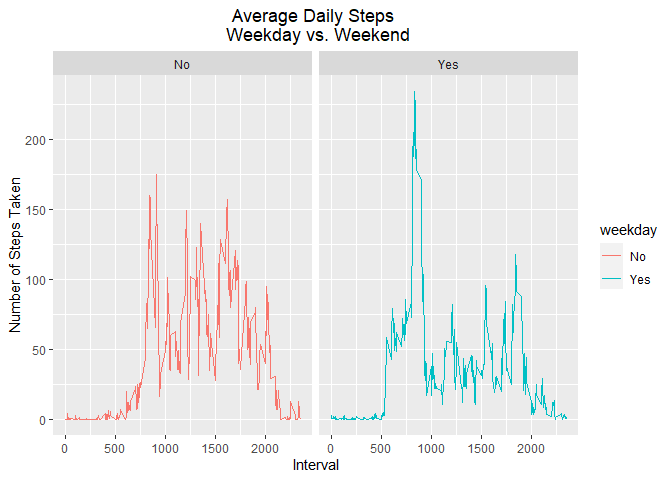

#Introduction

This R Markdown is part of the requirements of the 1st Course Project of Johns Hopkins University Data Science Specialization Course 5: Reproducible Research. The task requires a written report in a form of markdown answering the questions as indicated. 


## Loading and preprocessing the data

Show any code that is needed to:

#### 1. Load the data (i.e. read.csv())


```r
unzip("activity.zip")
activity_data<-read.csv("activity.csv")
```


#### 2. Process/transform the data (if necessary) into a format suitable for the analysis


```r
class(activity_data$date)
```

```
## [1] "character"
```

```r
activity_data$date<-as.Date(activity_data$date, format = "%Y-%m-%d")
class(activity_data$date)
```

```
## [1] "Date"
```

```r
head(activity_data)
```

```
##   steps       date interval
## 1    NA 2012-10-01        0
## 2    NA 2012-10-01        5
## 3    NA 2012-10-01       10
## 4    NA 2012-10-01       15
## 5    NA 2012-10-01       20
## 6    NA 2012-10-01       25
```

```r
summary(activity_data)
```

```
##      steps             date               interval     
##  Min.   :  0.00   Min.   :2012-10-01   Min.   :   0.0  
##  1st Qu.:  0.00   1st Qu.:2012-10-16   1st Qu.: 588.8  
##  Median :  0.00   Median :2012-10-31   Median :1177.5  
##  Mean   : 37.38   Mean   :2012-10-31   Mean   :1177.5  
##  3rd Qu.: 12.00   3rd Qu.:2012-11-15   3rd Qu.:1766.2  
##  Max.   :806.00   Max.   :2012-11-30   Max.   :2355.0  
##  NA's   :2304
```

## What is mean total number of steps taken per day?

Note: Missing values are ignored in the dataset.

#### 1. Calculate the total number of steps taken per day.


```r
library(dplyr)
total_steps_per_day <- activity_data %>% 
        group_by(date) %>% 
        summarise(total = sum(steps))
library(knitr)
kable(total_steps_per_day[1:10,], caption = "Total Number of Steps Taken per Day (First 10)")
```


Table: Total Number of Steps Taken per Day (First 10)

date          total
-----------  ------
2012-10-01       NA
2012-10-02      126
2012-10-03    11352
2012-10-04    12116
2012-10-05    13294
2012-10-06    15420
2012-10-07    11015
2012-10-08       NA
2012-10-09    12811
2012-10-10     9900


#### 2. If you do not understand the difference between a histogram and a barplot, research the difference between them. Make a histogram of the total number of steps taken each day.


```r
library(ggplot2)
ggplot(total_steps_per_day, aes(x=total)) + 
        geom_histogram(fill = "darkslategray3") +
        labs(title = "Histogram of the Total Number of Steps Taken Each Day", x = "Number of Steps Taken", y = "Count") +
        theme(plot.title = element_text(hjust = 0.5))
```

<!-- -->


#### 3. Calculate and report the mean and median of the total number of steps taken per day.

* Mean:

```r
mean(total_steps_per_day$total, na.rm = TRUE)
```

[1] 10766.19

* Median:

```r
median(total_steps_per_day$total, na.rm = TRUE)
```

[1] 10765


## What is the average daily activity pattern?

#### 1. Make a time series plot (i.e. type = "l") of the 5-minute interval (x-axis) and the average number of steps taken, averaged across all days (y-axis)


```r
library(dplyr)
average_per_interval <- activity_data %>% 
        group_by(interval) %>% 
        summarise(average = mean(steps, na.rm = TRUE))
library(knitr)
kable(average_per_interval[1:10,], caption = "Average Number of Steps Taken Averaged Across All Days (First 10)")
```


Table: Average Number of Steps Taken Averaged Across All Days (First 10)

 interval     average
---------  ----------
        0   1.7169811
        5   0.3396226
       10   0.1320755
       15   0.1509434
       20   0.0754717
       25   2.0943396
       30   0.5283019
       35   0.8679245
       40   0.0000000
       45   1.4716981

```r
library(ggplot2)
ggplot(average_per_interval, aes(x=average_per_interval$interval, y =average_per_interval$average)) +
        geom_line(color="#69b3a2", lwd =1.25) +
        labs(title = "Time Series Plot of the 5-Minute Interval \n and the Average Number of Steps Taken, Averaged Across All Days",
             x = "5 - Minute Intervals",
             y = "Average Number of Steps per Day") +
        theme(plot.title = element_text(hjust = 0.5))
```

<!-- -->


#### 2. Which 5-minute interval, on average across all the days in the dataset, contains the maximum number of steps?
The maximum number of steps is attained on:

```r
library(dplyr)
 maximum<-average_per_interval %>% 
        filter(average_per_interval$average ==max(average_per_interval$average))
 print(maximum$interval)
```

[1] 835


## Imputing Missing Values

Note that there are a number of days/intervals where there are missing values (coded as *NA*). The presence of missing days may introduce bias into some calculations or summaries of the data.


#### 1. Calculate and report the total number of missing values in the dataset (i.e. the total number of rows with *NA*s)

The number of missing data in the dataset is:


```r
sum(is.na(activity_data$steps), is.na(activity_data$date), is.na(activity_data$interval))
```

[1] 2304


#### 2. Devise a strategy for filling in all of the missing values in the dataset. The strategy does not need to be sophisticated. For example, you could use the mean/median for that day, or the mean for that 5-minute interval, etc.

The procedure selected is taking the mean for the 5-minute interval in replacement of the missing value on the steps.


```r
imputed_data <- merge(activity_data, average_per_interval, by = "interval", all.x =  TRUE, all.y = FALSE)
kable(imputed_data[1:10,], caption = "The original data with missing values. (First 10)")
```


Table: The original data with missing values. (First 10)

 interval   steps  date           average
---------  ------  -----------  ---------
        0      NA  2012-10-01    1.716981
        0       0  2012-11-23    1.716981
        0       0  2012-10-28    1.716981
        0       0  2012-11-06    1.716981
        0       0  2012-11-24    1.716981
        0       0  2012-11-15    1.716981
        0       0  2012-10-20    1.716981
        0       0  2012-11-16    1.716981
        0       0  2012-11-07    1.716981
        0       0  2012-11-25    1.716981

```r
imputed_data$steps <- ifelse(is.na(imputed_data$steps), imputed_data$average, imputed_data$steps)
library(knitr)
kable(imputed_data[1:10,], caption = "The resulting imputed data taking the average of the interval. (First 10)")
```


Table: The resulting imputed data taking the average of the interval. (First 10)

 interval      steps  date           average
---------  ---------  -----------  ---------
        0   1.716981  2012-10-01    1.716981
        0   0.000000  2012-11-23    1.716981
        0   0.000000  2012-10-28    1.716981
        0   0.000000  2012-11-06    1.716981
        0   0.000000  2012-11-24    1.716981
        0   0.000000  2012-11-15    1.716981
        0   0.000000  2012-10-20    1.716981
        0   0.000000  2012-11-16    1.716981
        0   0.000000  2012-11-07    1.716981
        0   0.000000  2012-11-25    1.716981

Check if there are no missing values on the data.


```r
sum(is.na(imputed_data$steps), is.na(imputed_data$date), is.na(imputed_data$interval))
```

[1] 0


#### 3. Create a new dataset that is equal to the original dataset but with the missing data filled in.


```r
imputed_data$average <- NULL
kable(imputed_data[1:10,], caption = "The resulting imputed data taking the average of the interval. (First 10)")
```


Table: The resulting imputed data taking the average of the interval. (First 10)

 interval      steps  date       
---------  ---------  -----------
        0   1.716981  2012-10-01 
        0   0.000000  2012-11-23 
        0   0.000000  2012-10-28 
        0   0.000000  2012-11-06 
        0   0.000000  2012-11-24 
        0   0.000000  2012-11-15 
        0   0.000000  2012-10-20 
        0   0.000000  2012-11-16 
        0   0.000000  2012-11-07 
        0   0.000000  2012-11-25 

#### 4. Make a histogram of the total number of steps taken each day and Calculate and report the mean and median total number of steps taken per day. Do these values differ from the estimates from the first part of the assignment? What is the impact of imputing missing data on the estimates of the total daily number of steps?


```r
imputed_total_steps_per_day <- imputed_data %>% 
        group_by(date) %>% 
        summarise(total = sum(steps))

ggplot(imputed_total_steps_per_day, aes(x=total)) + 
        geom_histogram(fill = "brown1", bins = 20) +
        labs(title = "Histogram of the Total Number of Steps Taken Each Day \n on the Imputed Data", 
             x = "Number of Steps Taken", y = "Count") +
        theme(plot.title = element_text(hjust = 0.5))
```

<!-- -->

* New Mean:

```r
mean(imputed_total_steps_per_day$total, na.rm = TRUE)
```

[1] 10766.19

* New Median:

```r
median(imputed_total_steps_per_day$total, na.rm = TRUE)
```

[1] 10766.19

Type of Estimate | Mean | Median
--- | --- | ---
activity_data (original dataset) | 10766.19 | 10765
imputed_data (with imputed values) | 10766.19 | 10766.19

Using the Average as the Imputed Value for Missing Data, the original dataset have the same mean as the imputed data set. However, the median of the imputed data set tends to increase in value minimally. This goes to show that datasets are somehow similar on the basis the measures of central tendency, mean and median.


## Are there differences in activity patterns between weekdays and weekends?


For this part the *weekdays()* function may be of some help here. Use the dataset with the filled-in missing values for this part.

#### 1. Create a new factor variable in the dataset with two levels – “weekday” and “weekend” indicating whether a given date is a weekday or weekend day.


```r
activity_data$date<-as.Date(activity_data$date, format = "%Y-%m-%d")
activity_data_weekday <- activity_data %>%
        mutate(day_of_the_week = weekdays(activity_data$date)) %>% 
        mutate(weekday = ifelse(day_of_the_week %in% c("Saturday", "Sunday"), "No","Yes"))
class(activity_data_weekday$weekday)
```

[1] "character"

```r
activity_data_weekday$weekday <- as.factor(activity_data_weekday$weekday)
class(activity_data_weekday$weekday)
```

[1] "factor"

```r
kable(activity_data_weekday[1:10,], caption = "New Activity Data (First 10)")
```


Table: New Activity Data (First 10)

 steps  date          interval  day_of_the_week   weekday 
------  -----------  ---------  ----------------  --------
    NA  2012-10-01           0  Monday            Yes     
    NA  2012-10-01           5  Monday            Yes     
    NA  2012-10-01          10  Monday            Yes     
    NA  2012-10-01          15  Monday            Yes     
    NA  2012-10-01          20  Monday            Yes     
    NA  2012-10-01          25  Monday            Yes     
    NA  2012-10-01          30  Monday            Yes     
    NA  2012-10-01          35  Monday            Yes     
    NA  2012-10-01          40  Monday            Yes     
    NA  2012-10-01          45  Monday            Yes     

```r
activity_data_weekday$day_of_the_week <- NULL
```

#### 2. Make a panel plot containing a time series plot (i.e. type = "l") of the 5-minute interval (x-axis) and the average number of steps taken, averaged across all weekday days or weekend days (y-axis). See the README file in the GitHub repository to see an example of what this plot should look like using simulated data.

Now, we get the average number of steps per 5 minute interval for the new dataset with the new factor variable, *weekday*.


```r
weekday_total_steps_per_day <- activity_data_weekday %>% 
        group_by(interval, weekday) %>% 
        summarise(average = mean(steps, na.rm = TRUE))
kable(weekday_total_steps_per_day[1:10,], caption = "Total Number of Steps Taken per Day. (First 10)")
```


Table: Total Number of Steps Taken per Day. (First 10)

 interval  weekday      average
---------  --------  ----------
        0  No         0.0000000
        0  Yes        2.3333333
        5  No         0.0000000
        5  Yes        0.4615385
       10  No         0.0000000
       10  Yes        0.1794872
       15  No         0.0000000
       15  Yes        0.2051282
       20  No         0.0000000
       20  Yes        0.1025641


```r
ggplot(weekday_total_steps_per_day, aes(x = interval, y = average, color = weekday)) +
        facet_wrap(~ weekday) +
        geom_line() +
        labs(title = "Average Daily Steps \n Weekday vs. Weekend", 
             x = "Interval",
             y = "Number of Steps Taken") +
        theme(plot.title = element_text(hjust = 0.5))
```

<!-- -->
